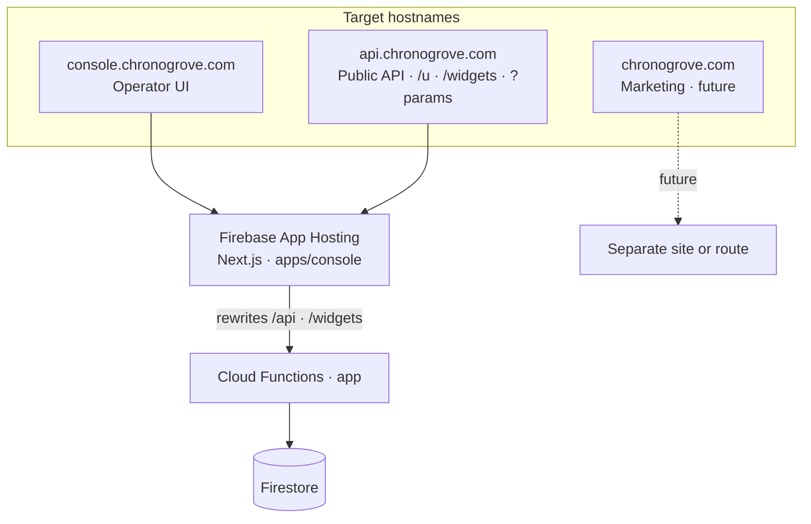
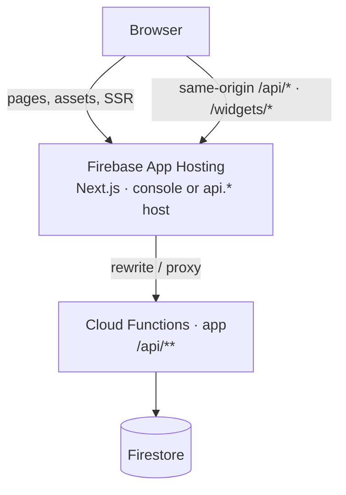
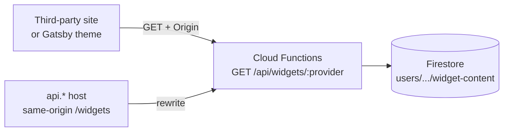
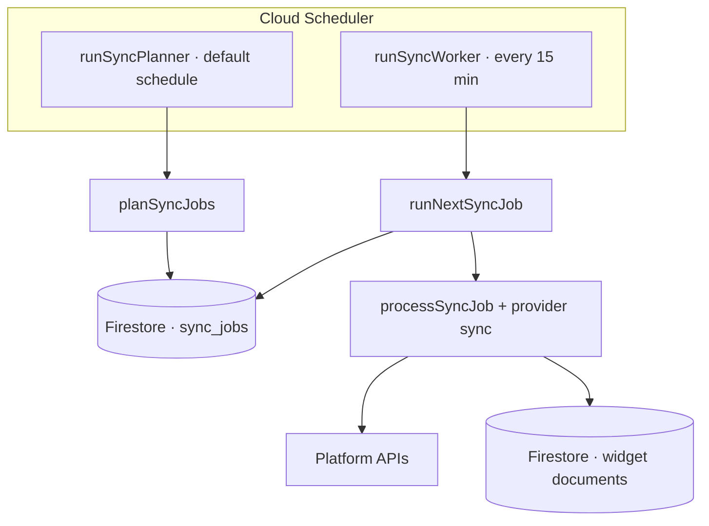
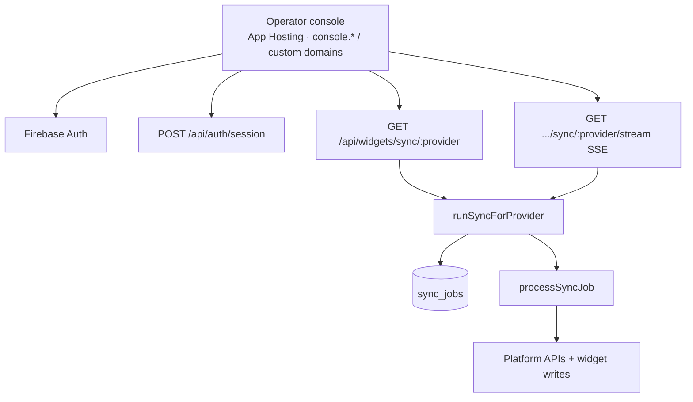

<h1 align='center'>
  Chronogrove
</h1>

<p align='center'>
  <a href='https://github.com/chrisvogt/chronogrove/actions/workflows/ci.yml'>
    
  </a>
  <a href='https://github.com/chrisvogt/chronogrove/actions/workflows/codeql.yml'>
    
  </a>
  <a href='https://codecov.io/gh/chrisvogt/chronogrove'>
    
  </a>
</p>

**Chronogrove** is the engine behind provider-backed widgets on [www.chrisvogt.me](https://www.chrisvogt.me): it syncs third-party accounts (Discogs, Steam, Instagram, Spotify, Goodreads, Flickr, and more), stores normalized widget documents, and serves them over a stable JSON API. Firebase is the reference runtime (**App Hosting** for the operator console and tenant-facing API domains, **Cloud Functions** for **`/api`**, and **Firestore**); the design stays portable enough to consider other hosts later.

**Production hostnames (target):** **`console.chronogrove.com`** is the main operator UI (sign-in, schema, sync, settings). **`api.chronogrove.com`** is the shared public API surface: **`/u/{username}`** (status), **`/widgets/:provider`**, and **`GET /api/widgets/:provider`** with optional **`?username=`** / **`?uid=`** where the host does not map a single tenant. **`chronogrove.com`** will eventually be a marketing site (separate from the console). Additional operator and tenant API hostnames are whatever you attach in Firebase (App Hosting custom domains, authorized Auth domains, and hostname maps); see [docs/APP_HOSTING.md](docs/APP_HOSTING.md).

Consumer experiences today include the open-source [**Gatsby theme Chronogrove**](https://github.com/chrisvogt/gatsby-theme-chronogrove). The goal is for the same API to power other site integrations (WordPress and similar) and, over time, shareable **Web Components** (and other HTML-native building blocks) that call the public routes directly.

This repository holds the **backend and operator console** (schema browser, status checks, authenticated sync). The themed marketing site and MDX content live in the Gatsby theme and site repos above.

> [!NOTE]
> **License:** This project is distributed under the [Apache License 2.0](LICENSE) (previously MIT). Details are in the root [CHANGELOG](CHANGELOG.md).

## Quick start (first 5 minutes)

1. **Install prerequisites**
   - Node.js (version in [.nvmrc](./.nvmrc), currently 24+)
   - pnpm (for example: `corepack enable && corepack prepare pnpm@10.32.1 --activate`)
   - Firebase CLI (`pnpm add -g firebase-tools` or `npm install -g firebase-tools`)
   - `firebase login`
2. **Clone and install**
   ```bash
   git clone git@github.com:chrisvogt/chronogrove.git
   cd chronogrove
   pnpm install
   ```
3. **Set local env vars**
   ```bash
   cp functions/.env.template functions/.env.local
   # edit functions/.env.local (at least CLIENT_API_KEY, CLIENT_AUTH_DOMAIN, CLIENT_PROJECT_ID)
   ```
4. **Run local dev (recommended)**
   ```bash
   pnpm run dev:full
   ```
5. **Open**
   - App: `http://localhost:5173`
   - Emulator UI: `http://127.0.0.1:4000`

If `/api` calls fail in local dev, the Functions emulator is usually not reachable.

## What this project does

- Fetches and serves widget data for: Spotify, Steam, Goodreads, Instagram, Discogs, Flickr, and GitHub.
- Supports scheduled sync jobs plus manual admin-triggered sync.
- Uses Firebase Auth (Google, email/password, phone) with HTTP-only session cookies and JWT fallback.
- Runs locally with Firebase emulators.
- Serves the Next.js operator console on Firebase App Hosting (**`console.chronogrove.com`** as the primary Chronogrove UI).

> Note: `github` is a readable widget provider, but **not** part of the scheduled/manual sync queue.

## Architecture at a glance

This service backs widgets on [www.chrisvogt.me](https://www.chrisvogt.me) and any client using the same API contract (for example the [Gatsby theme](https://github.com/chrisvogt/gatsby-theme-chronogrove)). Each diagram is intentionally focused on one path. For queue semantics and job document fields, see [docs/SYNC_JOB_QUEUE.md](docs/SYNC_JOB_QUEUE.md).

### Hostname roles (Chronogrove)

Custom domains attach to the **same** App Hosting backend (`apps/console`) unless you split marketing later. **`console.chronogrove.com`** is the operator experience; **`api.chronogrove.com`** (and tenant **`api.$user`**) expose JSON/widgets/status without a second stack.



### 0) Production edge (App Hosting + Cloud Functions)

The app is **SSR on Firebase App Hosting**. On whatever host the user opens (**`console.*`**, **`api.chronogrove.com`**, **`api.tenant.example`**, or any other hostname mapped to the same backend, …), the browser calls **`/api/*` and `/widgets/*` on that same origin**; Next.js **rewrites** both to the **`app`** Cloud Function (`/api/...` and `/api/widgets/...` respectively; see `apps/console/next.config.mjs`). That gives short widget URLs on tenant API domains without a second hostname. Third-party sites can still call the **Functions** URL or your **api.*** host from their own pages (diagram 1). **CORS** for credentialed cross-origin **`/api`** traffic uses a **fixed regex allowlist** in `functions/app/api-cors-allowlist.ts` (wired from `create-express-app.ts`), not tenant hostname settings—see [GitHub #289](https://github.com/chrisvogt/chronogrove/issues/289) (under epic [#252](https://github.com/chrisvogt/chronogrove/issues/252)). The `chrisvogt.me` pattern intentionally omits the legacy **`metrics`** operator label on that zone. Optional **public status** lives at **`/u/{username}`**; hosts in **`NEXT_PUBLIC_TENANT_API_ROOT_TO_USERNAME`** can serve it at **`/`** (internal rewrite in `src/proxy.ts`). Details: [docs/APP_HOSTING.md](docs/APP_HOSTING.md).



### 1) Public widget reads

Unauthenticated widget reads from Firestore-backed content. On a **shared** API host (**`api.chronogrove.com`**), **`GET /api/widgets/:provider`** may take optional **`?uid=`** or **`?username=`** to choose the data owner; **per-tenant domains** map **host → user** via Functions runtime config (**`WIDGET_USER_ID_BY_HOSTNAME`**) and can use same-origin **`/widgets/:provider`** (rewritten like diagram 0). Cross-origin **`fetch`** from arbitrary customer sites may require **CORS** to allow their origin; today the allowlist is regex-based in code, not user-configurable ([#289](https://github.com/chrisvogt/chronogrove/issues/289)).



### 2) Scheduled sync (planner + worker)

Planner enqueues one job per syncable provider. Worker claims queued jobs and runs provider sync.



### 3) Operator console manual sync

The signed-in operator UI (**`console.chronogrove.com`** target) uses Firebase Auth + session cookie. **`/api/*`** reaches Functions via the rewrite in diagram 0. Manual sync runs inline (enqueue → claim → process) instead of waiting for worker cadence.



### Key request flows

| Flow | Description |
|------|-------------|
| **Widget reads** | `GET /api/widgets/:provider` (public, cached). Reads provider widget document from Firestore and returns it. Optional **`?uid=`** / **`?username=`** on shared hosts; hostname map for dedicated API domains. Console same-origin **`/widgets/...`** rewrites to **`/api/widgets/...`**. |
| **Public status** | `GET /u/{username}` on App Hosting (SSR widget health table), e.g. **`api.chronogrove.com/u/{username}`**. Mapped tenant API hosts can show the same page at **`/`** via `src/proxy.ts`. |
| **Scheduled sync** | `runSyncPlanner` enqueues queue jobs; `runSyncWorker` periodically claims and executes queued jobs. |
| **Manual sync** | Authenticated `GET /api/widgets/sync/:provider` (JSON) or `GET /api/widgets/sync/:provider/stream` (SSE). Both use the same queue + inline processing path. |
| **Auth** | Dashboard signs in with Firebase Auth and creates a session cookie through `POST /api/auth/session`. Protected routes accept session cookie or JWT. |

## Monorepo layout

This repository is a pnpm workspace with:

- `apps/console/`: Next.js operator console (SSR on Firebase App Hosting)
- `functions/`: Firebase Cloud Functions backend (public **`/api`** and jobs)

Turborepo runs workspace scripts from the root and caches work.

**Use repo root for commands** (do not run per-package installs).

## Commands (repo root)

| Command | What it does |
|--------|----------------|
| `pnpm install` | Install dependencies for root and both packages. |
| `pnpm run dev` | Run Next.js dev server on `localhost:5173`. Expects Functions emulator to be running for `/api` calls. |
| `pnpm run dev:full` | Run **Auth, Firestore + Functions** emulators and Next dev together (App Hosting emulator omitted so only one `next dev` uses port 5173). |
| `pnpm run build` | Run workspace builds via Turborepo (Next **`.next`** output + `functions` TypeScript build). |
| `pnpm run lint` | Run workspace lint tasks (currently functions ESLint). |
| `pnpm run test` | Run workspace tests. |
| `pnpm run test:coverage` | Run tests with coverage. |
| `pnpm run deploy:all` | Guard env + build + deploy Firestore, Functions, and production App Hosting (`chronogrove-console`). |
| `pnpm run deploy:hosting` | Build and deploy only production App Hosting (`chronogrove-console`). |
| `pnpm run deploy:functions` | Guard env + deploy only Functions (Firebase predeploy still builds functions). |

> Use `pnpm run deploy:all` (with `run`). `pnpm deploy` is a pnpm command, not this project's deploy flow.

## Local development

### Option A (recommended): hot reload dashboard + emulators

One terminal:

```bash
pnpm run dev:full
```

Or split terminals:

```bash
# Terminal 1
firebase emulators:start --only functions,auth

# Terminal 2
pnpm run dev
```

Open `http://localhost:5173`.

### Option B: App Hosting emulator (optional)

For a runtime closer to production App Hosting (see `firebase.json` + `apps/console/apphosting.yaml`):

```bash
pnpm run build
firebase emulators:start --only apphosting,auth,functions,firestore
```

Open **http://metrics.dev-chrisvogt.me:8084** if that host resolves to localhost (see `emulators.apphosting` in `firebase.json`).

### Emulator URLs

| Service | URL |
|---------|-----|
| Emulator UI | `http://127.0.0.1:4000` |
| App Hosting (when started) | `http://metrics.dev-chrisvogt.me:8084` (or configured host in `firebase.json`) |
| Functions | `http://127.0.0.1:5001` |
| Auth | `http://127.0.0.1:9099` |
| Firestore | `http://127.0.0.1:8080` |

## Environment variables

For local development:

```bash
cp functions/.env.template functions/.env.local
```

Set at minimum:

- `CLIENT_API_KEY`
- `CLIENT_AUTH_DOMAIN`
- `CLIENT_PROJECT_ID`

Optional examples:

- `NODE_ENV=development`
- `GEMINI_API_KEY` (if AI summary features are enabled)

### Important env safety notes

- Never commit `functions/.env.local`.
- Avoid `functions/.env` during normal development; Firebase can deploy values from that file into Functions.

## API surface (high-level)

### Public widget reads

- `GET /api/widgets/:provider` where `provider` is one of:
  - `discogs`, `flickr`, `github`, `goodreads`, `instagram`, `spotify`, `steam`
- Optional query params on shared API hosts: **`uid`** (Firebase uid) or **`username`** (public slug). Per-tenant API domains use hostname → user mapping on the Functions side instead.
- Same-origin alias on the operator console (production or dev with rewrites): **`GET /widgets/:provider`** → Cloud Functions **`/api/widgets/:provider`**.

### Protected sync endpoints

- `GET /api/widgets/sync/:provider` (JSON)
- `GET /api/widgets/sync/:provider/stream` (SSE)

Syncable `provider` values are:

- `discogs`, `flickr`, `goodreads`, `instagram`, `spotify`, `steam`

### Auth/config endpoints

- `POST /api/auth/session`
- `POST /api/auth/logout`
- `GET /api/client-auth-config`
- `GET /api/firebase-config` (compat alias)

## Hosting and backend notes

### App Hosting backends

[`firebase.json`](firebase.json) registers two **App Hosting** backends, both with **`rootDir`: `apps/console`**:

| Backend | Typical use |
|---------|-------------|
| **`chronogrove-console`** | Production console; **`alwaysDeployFromSource`: true** in repo config. |
| **`chronogrove-console-pr`** | Optional second backend (e.g. previews/staging); same app tree, separate deploy target. |

Deploy scripts use **`chronogrove-console`** by default (`pnpm run deploy:hosting`). Classic **Firebase Hosting** (static CDN sites) is **not** used for this console.

### API routing

1. **Production (App Hosting):** Next.js rewrites **`/api/:path*`** to the deployed **`app`** Cloud Functions URL (same-origin in the browser; see `apps/console/next.config.mjs`).
2. **Production (App Hosting):** Next.js also rewrites **`/widgets/:path*`** to **`{CLOUD_FUNCTIONS_APP_ORIGIN}/api/widgets/:path*`** so tenant-facing domains can use short widget URLs.
3. **Local dev:** both rewrites target the Functions emulator on **`127.0.0.1:5001`** (`beforeFiles` so the App Router does not handle `/api` or `/widgets` first).
4. **Tenant status home:** for hosts in **`NEXT_PUBLIC_TENANT_API_ROOT_TO_USERNAME`**, **`src/proxy.ts`** rewrites **`/`** internally to **`/u/{slug}`** (browser URL stays **`/`**). See [docs/APP_HOSTING.md](docs/APP_HOSTING.md).
5. **Environment for rewrites:** public origins, tenant display host, and optional tenant hostname map are set in **`apps/console/apphosting.yaml`** (`NEXT_PUBLIC_*`); see [docs/APP_HOSTING.md](docs/APP_HOSTING.md).

### Backend details (`functions/`)

- Provider-neutral bootstrap wires runtime/config/store/auth adapters.
- Current implementation uses Firebase runtime/auth/document adapters.
- Functions source is TypeScript; build output is `functions/lib/`.

## Testing

From repo root:

```bash
pnpm run test
pnpm run test:coverage
```

Functions watch mode:

```bash
pnpm --filter chronogrove-functions run test:watch
```

## Deployment

**CI** runs lint, tests, and build; it does not deploy. **App Hosting** and **Functions** are usually released via the **Firebase** GitHub integration when connected to this repository. You can also deploy from the repo root with the CLI:

```bash
pnpm run build
pnpm run deploy:all
pnpm run deploy:hosting
pnpm run deploy:functions
```

Operator console layout, backends, `apphosting.yaml`, and how that ties to Cloud Functions are documented in **[docs/APP_HOSTING.md](docs/APP_HOSTING.md)**.

## Additional docs

Reference docs under [`docs/`](docs/):

| Document | What it covers |
|----------|----------------|
| [docs/APP_HOSTING.md](docs/APP_HOSTING.md) | Firebase App Hosting backends, `apphosting.yaml`, CI vs Firebase GitHub deploy / CLI, Next **`/api`** and **`/widgets`** rewrites, tenant **`/`** → **`/u/{slug}`**, public status SSR. |
| [docs/SYNC_JOB_QUEUE.md](docs/SYNC_JOB_QUEUE.md) | `sync_jobs` queue behavior (planner, worker, manual sync, states, summary metrics). |
| [docs/SESSION_COOKIES.md](docs/SESSION_COOKIES.md) | Session cookie model, `/api/auth/session`, JWT fallback, security properties. |
| [docs/MULTI_TENANT_ARCHITECTURE_PLAN.md](docs/MULTI_TENANT_ARCHITECTURE_PLAN.md) | Migration plan from single-tenant env config toward user-scoped storage and sync. |

## Contributing

1. Fork the repository.
2. Create a feature branch (`git checkout -b feature/amazing-feature`).
3. Install and configure local env.
4. Run tests (`pnpm run test`).
5. Ensure builds pass (`pnpm run build`).
6. Open a pull request.

## Copyright & License

Copyright © 2020-2026 [Chris Vogt](https://www.chrisvogt.me). Licensed under the [Apache License 2.0](LICENSE).
