<h1 align='center'>
  Social Metrics API (<a href='https://metrics.chrisvogt.me' title='metrics.chrisvogt.me'>metrics.chrisvogt.me</a>)
</h1>

<p align='center'>
  <a href='https://github.com/chrisvogt/metrics/actions/workflows/ci.yml'>
    
  </a>
  <a href='https://github.com/chrisvogt/metrics/actions/workflows/codeql.yml'>
    
  </a>
  <a href='https://codecov.io/gh/chrisvogt/metrics'>
    
  </a>
</p>

This repository contains a portable metrics service I use to fetch and sync data for widgets on my personal website, [www.chrisvogt.me](https://www.chrisvogt.me). Firebase remains the current reference provider, but the backend is being refactored to stay open to self-hosted, containerized, and serverless runtime choices.

## Features

- **Multi-Platform Data Sync**: Integrates with Spotify, Steam, Goodreads, Instagram, Discogs, and Flickr
- **Firebase Authentication**: Secure user authentication with email/password, phone, and Google sign-in
- **Session Management**: Secure session cookies with JWT token fallback
- **Real-time Data**: Live data fetching and caching for widget content
- **Local Development**: Full Firebase emulator support for development

## How It Works

The diagram below shows how this service powers the social widgets on [www.chrisvogt.me](https://www.chrisvogt.me). The **website** calls public read endpoints to fetch widget data; the **admin dashboard** triggers manual syncs and manages auth. Behind the scenes, a Firestore-backed job queue orchestrates nightly data syncs across six platform APIs.

```mermaid
flowchart TB
  %% ── External Clients ──────────────────────────────────────────────
  website["<b>www.chrisvogt.me</b><br/>(Gatsby · Netlify)"]
  admin["<b>metrics.chrisvogt.me</b><br/>(React admin dashboard)"]

  %% ── Cloud Scheduler ───────────────────────────────────────────────
  subgraph scheduler["Cloud Scheduler"]
    cron_plan["<b>runSyncPlanner</b><br/>every day 02:00"]
    cron_worker["<b>runSyncWorker</b><br/>every 15 min"]
  end

  %% ── Cloud Functions (Express) ─────────────────────────────────────
  subgraph functions["Cloud Functions · Express App"]
    direction TB

    subgraph read_endpoints["Public Widget Read Endpoints"]
      get_widget["GET /api/widgets/:provider<br/><i>getWidgetContent()</i>"]
    end

    subgraph auth_endpoints["Auth & Config Endpoints"]
      session_ep["POST /api/auth/session"]
      config_ep["GET /api/client-auth-config"]
    end

    subgraph sync_endpoints["Manual Sync Endpoint <i>(auth required)</i>"]
      manual_sync["GET /api/widgets/sync/:provider<br/><i>runSyncForProvider()</i>"]
    end

    subgraph orchestration["Sync Orchestration"]
      planner["<b>planSyncJobs</b><br/>enqueue one job per provider<br/>for default widget user"]
      worker["<b>runNextSyncJob</b><br/>claimNextJob → processSyncJob"]
    end

    subgraph provider_jobs["Provider Sync Jobs"]
      direction LR
      job_steam["sync-steam-data"]
      job_spotify["sync-spotify-data"]
      job_instagram["sync-instagram-data"]
      job_goodreads["sync-goodreads-data"]
      job_discogs["sync-discogs-data"]
      job_flickr["sync-flickr-data"]
    end
  end

  %% ── Firestore ─────────────────────────────────────────────────────
  subgraph firestore["Cloud Firestore"]
    queue_docs[("sync_jobs<br/><i>queue documents</i><br/>status · runCount · summary")]
    widget_docs[("users/{userId}/{provider}<br/><i>widget-content</i><br/>profile · collections · metrics")]
  end

  %% ── Firebase Auth ─────────────────────────────────────────────────
  fb_auth["Firebase Auth<br/>(Google · email · phone)"]

  %% ── External Platform APIs ────────────────────────────────────────
  subgraph apis["External Platform APIs"]
    direction LR
    api_steam["Steam Web API"]
    api_spotify["Spotify API"]
    api_instagram["Instagram Graph API<br/>(v25.0)"]
    api_goodreads["Goodreads"]
    api_discogs["Discogs API"]
    api_flickr["Flickr API"]
  end

  %% ── Widget Read Path ──────────────────────────────────────────────
  website -- "GET /api/widgets/:provider" --> get_widget
  get_widget -- "read" --> widget_docs

  %% ── Admin Auth Path ───────────────────────────────────────────────
  admin -- "sign-in / session" --> session_ep
  admin -- "load config" --> config_ep
  session_ep --> fb_auth
  config_ep --> fb_auth

  %% ── Manual Sync Path ──────────────────────────────────────────────
  admin -- "trigger sync<br/>(authenticated)" --> manual_sync
  manual_sync -- "enqueue + claimJob" --> queue_docs
  manual_sync --> worker

  %% ── Scheduled Sync Path ───────────────────────────────────────────
  cron_plan --> planner
  planner -- "enqueue<br/>(skip if already active)" --> queue_docs
  cron_worker --> worker
  worker -- "claimNextJob" --> queue_docs

  %% ── Worker → Provider Jobs ────────────────────────────────────────
  worker --> job_steam & job_spotify & job_instagram & job_goodreads & job_discogs & job_flickr

  %% ── Provider Jobs → External APIs ─────────────────────────────────
  job_steam --> api_steam
  job_spotify --> api_spotify
  job_instagram --> api_instagram
  job_goodreads --> api_goodreads
  job_discogs --> api_discogs
  job_flickr --> api_flickr

  %% ── Provider Jobs → Firestore widget data ─────────────────────────
  job_steam -- "write" --> widget_docs
  job_spotify -- "write" --> widget_docs
  job_instagram -- "write" --> widget_docs
  job_goodreads -- "write" --> widget_docs
  job_discogs -- "write" --> widget_docs
  job_flickr -- "write" --> widget_docs

  %% ── Worker updates queue status ───────────────────────────────────
  worker -. "completeJob / failJob" .-> queue_docs

  %% ── Styles ────────────────────────────────────────────────────────
  classDef client fill:#e8f4fd,stroke:#2196f3,stroke-width:2px,color:#0d47a1
  classDef sched fill:#fff3e0,stroke:#ff9800,stroke-width:2px,color:#e65100
  classDef func fill:#f3e5f5,stroke:#9c27b0,stroke-width:1px,color:#4a148c
  classDef store fill:#e8f5e9,stroke:#4caf50,stroke-width:2px,color:#1b5e20
  classDef extapi fill:#fce4ec,stroke:#e91e63,stroke-width:1px,color:#880e4f
  classDef authnode fill:#fff8e1,stroke:#ffc107,stroke-width:2px,color:#f57f17

  class website,admin client
  class cron_plan,cron_worker sched
  class get_widget,session_ep,config_ep,manual_sync,planner,worker,job_steam,job_spotify,job_instagram,job_goodreads,job_discogs,job_flickr func
  class queue_docs,widget_docs store
  class api_steam,api_spotify,api_instagram,api_goodreads,api_discogs,api_flickr extapi
  class fb_auth authnode
```



**Key flows:**

| Path | Description |
|------|-------------|
| **Widget reads** | The website calls `GET /api/widgets/:provider` (public, cached). The handler reads the provider's `widget-content` document from Firestore and returns it. |
| **Scheduled sync** | Cloud Scheduler fires `runSyncPlanner` daily at 02:00, which enqueues one job per provider into the `sync_jobs` Firestore collection. `runSyncWorker` runs every 15 minutes, claims the next queued job, calls the provider's external API, writes fresh data to Firestore, and marks the job completed or failed. |
| **Manual sync** | An authenticated admin triggers `GET /api/widgets/sync/:provider`. The handler enqueues a job, claims it inline, runs the provider sync immediately, and returns before/after queue snapshots. |
| **Auth** | The admin dashboard authenticates via Firebase Auth (Google, email, or phone) and creates an HTTP-only session cookie through `POST /api/auth/session`. Sync endpoints require a valid session or JWT. |

## Documentation

Design notes and architecture references live under [`docs/`](docs/). The table below links each file to its topic.

| Document | What it covers |
|----------|----------------|
| [docs/SYNC_JOB_QUEUE.md](docs/SYNC_JOB_QUEUE.md) | Firestore `sync_jobs` queue: planner, worker, manual sync, job states, optional **`summary.metrics`** from provider sync jobs, and related source files. |
| [docs/SESSION_COOKIES.md](docs/SESSION_COOKIES.md) | Firebase session cookies (HTTP-only), `/api/auth/session`, JWT fallback, and security properties. |
| [docs/MULTI_TENANT_ARCHITECTURE_PLAN.md](docs/MULTI_TENANT_ARCHITECTURE_PLAN.md) | Plan for evolving from single-tenant env-based config toward user-scoped storage and sync. |

## How to install

### Prerequisites

- **Node.js** (version in [.nvmrc](./.nvmrc), e.g. 24)
- **pnpm** (e.g. `corepack enable && corepack prepare pnpm@10.32.1 --activate`, or see [pnpm.io](https://pnpm.io/installation))
- **Firebase CLI** (`pnpm add -g firebase-tools` or `npm install -g firebase-tools`)
- **Firebase project** and `firebase login`

### Install steps

1. **Clone and install all dependencies**
   ```bash
   git clone git@github.com:chrisvogt/metrics.git
   cd metrics
   pnpm install
   ```
   This installs dependencies for the root, `hosting/`, and `functions/` in one go (see [Monorepo](#monorepo) below).

2. **Configure environment (local development)**  
   In `functions/`, copy the env template and set values (see [Environment variables](#environment-variables) below):
   ```bash
   cp functions/.env.template functions/.env.local
   # Edit functions/.env.local (CLIENT_API_KEY, CLIENT_AUTH_DOMAIN, CLIENT_PROJECT_ID, etc.)
   ```

### Environment variables

For local development, copy the template and set your values:

```bash
# In the /functions directory
cp .env.template .env.local
# Edit .env.local with your actual values
```

**Important:** Never commit `functions/.env.local` to version control. It contains sensitive information like API keys.
Also avoid using `functions/.env` for normal development, because Firebase deploys that file's values into Cloud Functions.

#### Required Environment Variables

The following variables are required for the authentication system to work:

- `CLIENT_API_KEY` - Your Firebase API key
- `CLIENT_AUTH_DOMAIN` - Your Firebase auth domain (e.g., `your-project.firebaseapp.com`)
- `CLIENT_PROJECT_ID` - Your Firebase project ID

#### Optional Environment Variables

- `NODE_ENV` - Set to `development` for local development
- `GEMINI_API_KEY` - For AI-powered summaries (if using Gemini integration)

### Client Auth Configuration

The current client auth config payload (still Firebase-shaped while auth migration is deferred) is served from the backend so it isn’t hardcoded in the client.

#### Local (development)
Set `CLIENT_API_KEY`, `CLIENT_AUTH_DOMAIN`, and `CLIENT_PROJECT_ID` in your `functions/.env.local` file.

#### Option 2: Production (Secret Manager)
Production config lives in **Google Cloud Secret Manager** as the secret **`FUNCTIONS_CONFIG_EXPORT`** (one JSON object with all keys). To create or update it: run `firebase functions:config:export`, or in [Secret Manager](https://console.cloud.google.com/security/secret-manager) add a new version of that secret with JSON matching the shape in `functions/config/exported-config.ts` (see `CONFIG_PATH_TO_ENV`; e.g. `auth.client_api_key`, `github.access_token`, `spotify.client_id`, etc.).

For production deploys, leave disk-only storage settings such as `LOCAL_MEDIA_ROOT` and `MEDIA_STORE_BACKEND=disk` unset. The backend defaults production media storage to GCS, while the secret-backed storage values provide the Firestore database URL, bucket, and public media base URL.

## Monorepo

This repo is a **pnpm workspace** with two packages: `hosting` (React app) and `functions` (Firebase Cloud Functions). **[Turborepo](https://turbo.build/repo)** runs tasks across the workspace: it only runs a script in packages that define it, caches outputs, and avoids redundant work.

**Use the root for all commands.** Do not run `npm` or `pnpm install` inside `hosting/` or `functions/`; use `pnpm install` at the repo root once.

### Commands (from repo root)

| Command | What it does |
|--------|----------------|
| `pnpm install` | Install dependencies for root and all workspace packages (single lockfile: `pnpm-lock.yaml`). |
| `pnpm run build` | Build the hosting app (Vite → `hosting/dist`). Only the hosting package has a `build` script. |
| `pnpm run dev` | Start the hosting app’s Vite dev server (hot reload). For API calls to work, also run the Functions + Auth emulators (see [Development](#development)). |
| `pnpm run dev:full` | Start the Functions + Auth emulators and the Vite dev server in one command (recommended for local dev). |
| `pnpm run lint` | Lint the functions package (ESLint). |
| `pnpm run test` | Run functions unit tests (Vitest), single run. |
| `pnpm run test:coverage` | Run functions tests with coverage. |
| `pnpm run deploy:all` | Build hosting, then deploy everything (hosting + functions + Firestore rules, etc.) to Firebase. |
| `pnpm run deploy:hosting` | Build hosting, then deploy only Firebase Hosting. |
| `pnpm run deploy:functions` | Deploy only Cloud Functions (no build). |

**Note:** Use `pnpm run deploy:all` (with **run**). The bare `pnpm deploy` is pnpm’s own command and is not our Firebase deploy.

## Development

### Option A – Hosting app with hot reload (recommended)

**One command** (emulators + Vite together):

```bash
pnpm run dev:full
```

**Or** use two terminals:

```bash
# Terminal 1: start Functions + Auth emulators
firebase emulators:start --only functions,auth

# Terminal 2: start the hosting app (from repo root)
pnpm run dev
```

Open **http://localhost:5173**. The Vite dev server proxies `/api` to the Functions emulator. Sign-in and API testing work against the emulators. If you run only `pnpm run dev` without the emulators, API requests will receive a 503 with a message to start the backend.

### Option B – Full Firebase emulators (Hosting + Functions + Auth)

Build the hosting app once, then run all emulators so the site is served like production:

```bash
# From repo root: build the React app, then start emulators
pnpm run build
firebase emulators:start --only hosting,functions,auth
```

Open the Hosting URL (e.g. **http://metrics.dev-chrisvogt.me:8084**). Same rewrites as production: `/api/**` → Cloud Function, `**` → SPA.

### Emulator URLs

| Service   | URL                    |
|----------|------------------------|
| Emulator UI | http://127.0.0.1:4000 |
| Hosting  | http://127.0.0.1:8084 (or configured host) |
| Functions| http://127.0.0.1:5001 |
| Auth     | http://127.0.0.1:9099 |
| Firestore| http://127.0.0.1:8080 |

### Authentication System

The application includes a comprehensive authentication system with:

- **Email/Password Login**: Traditional email and password authentication
- **Phone Authentication**: SMS-based verification with Firebase Phone Auth
- **Google Sign-In**: OAuth authentication with Google accounts
- **Session Management**: Secure HTTP-only cookies with JWT fallback
- **Multi-tenant Support**: Ready for future multi-user expansion

### API Endpoints

The following endpoints are available:

| Widget | Description | Auth Required |
|--------|-------------|---------------|
| `/api/widgets/spotify` | GET Spotify widget content | No |
| `/api/widgets/sync/spotify` | Trigger Spotify data sync | Yes |
| `/api/widgets/steam` | GET Steam widget content | No |
| `/api/widgets/sync/steam` | Trigger Steam data sync | Yes |
| `/api/widgets/goodreads` | GET Goodreads widget content | No |
| `/api/widgets/sync/goodreads` | Trigger Goodreads data sync | Yes |
| `/api/widgets/instagram` | GET Instagram widget content | No |
| `/api/widgets/sync/instagram` | Trigger Instagram data sync | Yes |
| `/api/widgets/discogs` | GET Discogs widget content | No |
| `/api/widgets/sync/discogs` | Trigger Discogs data sync | Yes |
| `/api/widgets/flickr` | GET Flickr widget content | No |
| `/api/widgets/sync/flickr` | Trigger Flickr data sync | Yes |

### Authentication Endpoints

- `/api/auth/session` - Create session cookies (POST)
- `/api/client-auth-config` - Get client auth configuration (GET)
- `/api/firebase-config` - Compatibility alias for the current Firebase-based client auth flow (GET)

## Architecture

### Frontend (hosting)
- **React + Vite** app in `hosting/`: sign-in (Google, email, phone) and API testing dashboard
- **Firebase SDK**: Client-side auth for the current auth provider; config loaded at runtime from `/api/client-auth-config`
- **Session**: Cookie-based sessions (created via `/api/auth/session`) with JWT fallback
- **Build**: From repo root, `pnpm run build` → `hosting/dist`; Firebase Hosting serves that folder and rewrites `/api/**` to the Cloud Function and `**` to `/index.html` (SPA)

See [hosting/README.md](hosting/README.md) for hosting-only scripts and local dev details.

### Backend (functions)
- **Provider-neutral bootstrap**: Backend composition selects runtime, config source, document store, media store, auth service, and clock from a single bootstrap layer
- **Firebase runtime/auth/document adapters**: Current reference provider implementations
- **Firestore-compatible document layout**: Existing data remains readable while new timestamps are written in a portable format
- **External APIs**: Integration with various platform APIs

#### TypeScript
The `functions/` package is TypeScript. Source lives in `functions/*.ts` and role-based dirs: `config/`, `widgets/`, `utils/`, `helpers/` (plus `api/`, `jobs/`, `transformers/`, etc.). `pnpm run build` (from repo root or from `functions/`) compiles with `tsc` and outputs only to `functions/lib/`; `lib/` is gitignored. Firebase deploys from `lib/`. Run `pnpm run build` before `pnpm run deploy:functions` if you’ve changed function code. Tests (`pnpm run test`) and lint (`pnpm run lint`) run against the TypeScript source.

### Security Features
- **CORS Protection**: Configurable cross-origin resource sharing
- **Rate Limiting**: Built-in request throttling
- **Session Validation**: Secure session cookie validation
- **Environment Isolation**: Separate configs for development/production

## Testing

Tests live in `functions/`. From repo root:

```bash
pnpm run test              # run once
pnpm run test:coverage     # with coverage
```

For watch mode, run from the functions package: `pnpm --filter metrics-functions run test:watch`.

## Deployment

The hosting app must be **built** before deploy (the root `deploy:all` script does this automatically). All commands from repo root; see [Monorepo](#monorepo) for the full command list.

```bash
pnpm run build          # build hosting app only (output: hosting/dist)
pnpm run deploy:all     # build + deploy everything (hosting + functions + Firestore, etc.)
pnpm run deploy:hosting # build + deploy hosting only
pnpm run deploy:functions # deploy Cloud Functions only (no build)
```

## Contributing

1. Fork the repository
2. Create a feature branch (`git checkout -b feature/amazing-feature`)
3. Install and set up (see [How to install](#how-to-install) and [Environment variables](#environment-variables))
4. Run tests: `pnpm run test` (from repo root)
5. Ensure the hosting app builds: `pnpm run build` (from repo root)
6. Commit your changes and open a Pull Request

## Copyright & License

Copyright © 2020-2025 [Chris Vogt](https://www.chrisvogt.me). Released under the [MIT License](LICENSE).
