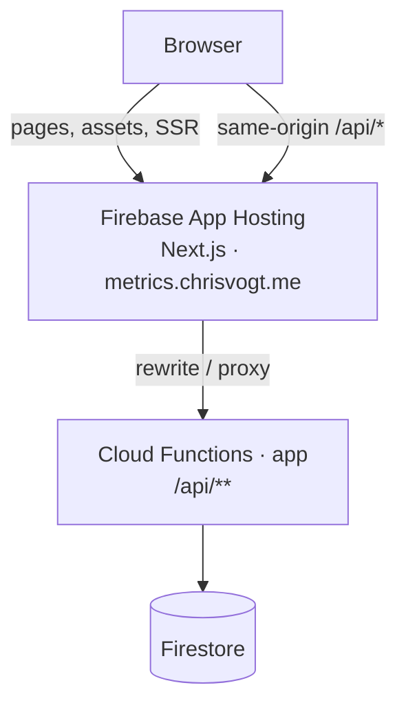
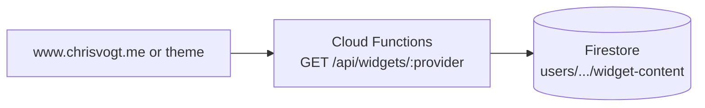
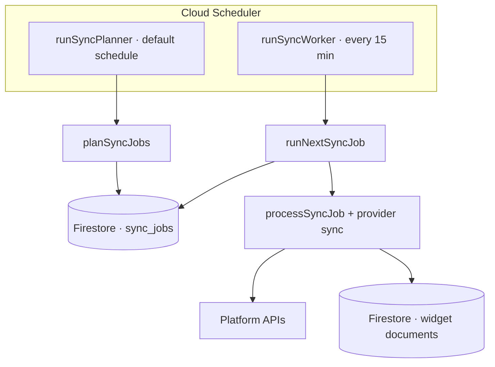
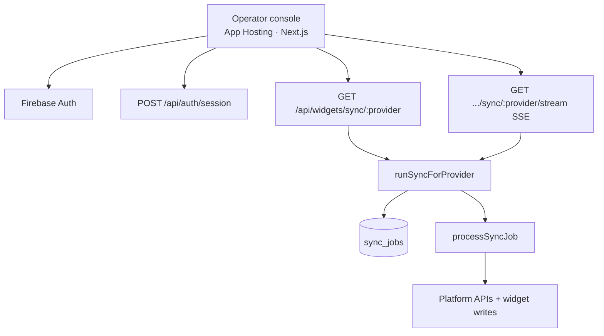

<h1 align='center'>
  Chronogrove (<a href='https://metrics.chrisvogt.me' title='Operator console'>metrics.chrisvogt.me</a>)
</h1>

<p align='center'>
  <a href='https://github.com/chrisvogt/chronogrove/actions/workflows/ci.yml'>
    
  </a>
  <a href='https://github.com/chrisvogt/chronogrove/actions/workflows/codeql.yml'>
    
  </a>
  <a href='https://codecov.io/gh/chrisvogt/chronogrove'>
    
  </a>
</p>

**Chronogrove** is the engine behind provider-backed widgets on [www.chrisvogt.me](https://www.chrisvogt.me): it syncs third-party accounts (Discogs, Steam, Instagram, Spotify, Goodreads, Flickr, and more), stores normalized widget documents, and serves them over a stable JSON API. Firebase is the reference runtime (**App Hosting** for the operator console, **Cloud Functions** for **`/api`**, and **Firestore**); the design stays portable enough to consider other hosts later.

Consumer experiences today include the open-source [**Gatsby theme Chronogrove**](https://github.com/chrisvogt/gatsby-theme-chronogrove). The goal is for the same API to power other site integrations (WordPress and similar) and, over time, shareable **Web Components** (and other HTML-native building blocks) that call the public routes directly.

This repository holds the **backend**, **operator console**, and a **static marketing site** (`apps/www/`, Firebase Hosting classic for chronogrove.com). Themed consumer sites and MDX content also live in the Gatsby theme and site repos.

> [!NOTE]
> **License:** This project is distributed under the [Apache License 2.0](LICENSE) (previously MIT). Details are in the root [CHANGELOG](CHANGELOG.md).

## Quick start (first 5 minutes)

1. **Install prerequisites**
   - Node.js (version in [.nvmrc](./.nvmrc), currently 24+)
   - pnpm (for example: `corepack enable && corepack prepare pnpm@10.32.1 --activate`)
   - Firebase CLI (`pnpm add -g firebase-tools` or `npm install -g firebase-tools`)
   - `firebase login`
2. **Clone and install**
   ```bash
   git clone git@github.com:chrisvogt/chronogrove.git
   cd chronogrove
   pnpm install
   ```
3. **Set local env vars**
   ```bash
   cp functions/.env.template functions/.env.local
   # edit functions/.env.local (at least CLIENT_API_KEY, CLIENT_AUTH_DOMAIN, CLIENT_PROJECT_ID)
   ```
4. **Run local dev (recommended)**
   ```bash
   pnpm run dev:full
   ```
5. **Open**
   - Operator console: `http://localhost:5173`
   - Marketing site (`pnpm dev:full` only): `http://localhost:5174`
   - Emulator UI: `http://127.0.0.1:4000`

If `/api` calls fail in local dev, the Functions emulator is usually not reachable.

**Optional — local hostnames:** To mirror production subdomains on your machine, add the entries in [docs/LOCAL_DEV.md](docs/LOCAL_DEV.md) to `/etc/hosts`, then use URLs like `http://dev-chronogrove.com:5174` and `http://console.dev-chronogrove.com:5173`. Add the same hostnames under **Firebase → Authentication → Settings → Authorized domains** so sign-in works.

## What this project does

- Fetches and serves widget data for: Spotify, Steam, Goodreads, Instagram, Discogs, Flickr, and GitHub.
- Supports scheduled sync jobs plus manual admin-triggered sync.
- Uses Firebase Auth (Google, email/password, phone) with HTTP-only session cookies and JWT fallback.
- Runs locally with Firebase emulators.
- Serves the Next.js operator dashboard at [metrics.chrisvogt.me](https://metrics.chrisvogt.me).

> Note: `github` is a readable widget provider, but **not** part of the scheduled/manual sync queue.

## Architecture at a glance

This service backs widgets on [www.chrisvogt.me](https://www.chrisvogt.me) and any client using the same API contract (for example the [Gatsby theme](https://github.com/chrisvogt/gatsby-theme-chronogrove)). Each diagram is intentionally focused on one path. For queue semantics and job document fields, see [docs/SYNC_JOB_QUEUE.md](docs/SYNC_JOB_QUEUE.md).

### 0) Production edge (operator console)

The dashboard is **SSR on Firebase App Hosting**. The browser calls **`/api/*` on the same origin**; Next.js **rewrites** those requests to the **`app`** Cloud Function (see `apps/console/next.config.ts`). Public widget traffic from other sites still hits Functions directly (diagrams 1–2).



### 1) Public widget reads

Unauthenticated widget reads from Firestore-backed content.



### 2) Scheduled sync (planner + worker)

Planner enqueues one job per syncable provider. Worker claims queued jobs and runs provider sync.



### 3) Operator console manual sync

[metrics.chrisvogt.me](https://metrics.chrisvogt.me) (App Hosting) uses Firebase Auth + session cookie. **`/api/*`** reaches Functions via the rewrite shown in diagram 0. Manual sync runs inline (enqueue → claim → process) instead of waiting for worker cadence.



### Key request flows

| Flow | Description |
|------|-------------|
| **Widget reads** | `GET /api/widgets/:provider` (public, cached). Reads provider widget document from Firestore and returns it. |
| **Scheduled sync** | `runSyncPlanner` enqueues queue jobs; `runSyncWorker` periodically claims and executes queued jobs. |
| **Manual sync** | Authenticated `GET /api/widgets/sync/:provider` (JSON) or `GET /api/widgets/sync/:provider/stream` (SSE). Both use the same queue + inline processing path. |
| **Auth** | Dashboard signs in with Firebase Auth and creates a session cookie through `POST /api/auth/session`. Protected routes accept session cookie or JWT. |

## Monorepo layout

This repository is a pnpm workspace with:

- `apps/console/`: Next.js operator console (SSR on Firebase App Hosting)
- `apps/www/`: Vite + React marketing site (static build on Firebase Hosting classic)
- `functions/`: Firebase Cloud Functions backend (public **`/api`** and jobs)

Turborepo runs workspace scripts from the root and caches work.

**Use repo root for commands** (do not run per-package installs).

## Commands (repo root)

| Command | What it does |
|--------|----------------|
| `pnpm install` | Install dependencies for all workspace packages. |
| `pnpm run dev` | Run **all** packages that define `dev` (console + www via Turbo). For `/api`, use `dev:full` or run the Functions emulator separately. |
| `pnpm run dev:console` | Next.js dev server only — `http://localhost:5173`. |
| `pnpm run dev:www` | Vite dev server only — `http://localhost:5174`. |
| `pnpm run dev:full` | **Auth, Firestore + Functions** emulators + **console** (`5173`) + **www** (`5174`) via `concurrently`. |
| `pnpm run build` | Run workspace builds via Turborepo (Next **`.next`**, `apps/www/dist`, `functions` build). |
| `pnpm run lint` | Run workspace lint tasks (currently functions ESLint). |
| `pnpm run test` | Run workspace tests. |
| `pnpm run test:coverage` | Run tests with coverage. |
| `pnpm run deploy:all` | Guard env + build + deploy Firestore, Functions, App Hosting (`chronogrove-console`), and classic Hosting (`www`). |
| `pnpm run deploy:console` | Build and deploy only production App Hosting (`chronogrove-console`). |
| `pnpm run deploy:www` | Build `apps/www` and deploy only the classic Hosting site (`www` target). |
| `pnpm run deploy:functions` | Guard env + deploy only Functions (Firebase predeploy still builds functions). |

> Use `pnpm run deploy:all` (with `run`). `pnpm deploy` is a pnpm command, not this project's deploy flow.

## Local development

See **[docs/LOCAL_DEV.md](docs/LOCAL_DEV.md)** for ports, optional `/etc/hosts` aliases, Firebase Auth **authorized domains**, and an optional Caddy reverse-proxy setup.

### Option A (recommended): emulators + console + marketing site

One terminal:

```bash
pnpm run dev:full
```

Or split terminals:

```bash
# Terminal 1 — Auth, Firestore, Functions
firebase emulators:start --only auth,functions,firestore

# Terminal 2 — operator console
pnpm run dev:console

# Terminal 3 — marketing site (optional)
pnpm run dev:www
```

Open the **console** at `http://localhost:5173` and the **marketing site** at `http://localhost:5174` (when running `dev:www` or `dev:full`).

### Option B: App Hosting emulator (optional)

For a runtime closer to production App Hosting (see `firebase.json` + `apps/console/apphosting.yaml`):

```bash
pnpm run build
firebase emulators:start --only apphosting,auth,functions,firestore
```

Open **http://metrics.dev-chrisvogt.me:8084** if that host resolves to localhost (see `emulators.apphosting` in `firebase.json`).

### Emulator URLs

| Service | URL |
|---------|-----|
| Emulator UI | `http://127.0.0.1:4000` |
| App Hosting (when started) | `http://metrics.dev-chrisvogt.me:8084` (or configured host in `firebase.json`) |
| Functions | `http://127.0.0.1:5001` |
| Auth | `http://127.0.0.1:9099` |
| Firestore | `http://127.0.0.1:8080` |

## Environment variables

For local development:

```bash
cp functions/.env.template functions/.env.local
```

Set at minimum:

- `CLIENT_API_KEY`
- `CLIENT_AUTH_DOMAIN`
- `CLIENT_PROJECT_ID`

Optional examples:

- `NODE_ENV=development`
- `GEMINI_API_KEY` (if AI summary features are enabled)

### Important env safety notes

- Never commit `functions/.env.local`.
- Avoid `functions/.env` during normal development; Firebase can deploy values from that file into Functions.

## API surface (high-level)

### Public widget reads

- `GET /api/widgets/:provider` where `provider` is one of:
  - `discogs`, `flickr`, `github`, `goodreads`, `instagram`, `spotify`, `steam`

### Protected sync endpoints

- `GET /api/widgets/sync/:provider` (JSON)
- `GET /api/widgets/sync/:provider/stream` (SSE)

Syncable `provider` values are:

- `discogs`, `flickr`, `goodreads`, `instagram`, `spotify`, `steam`

### Auth/config endpoints

- `POST /api/auth/session`
- `POST /api/auth/logout`
- `GET /api/client-auth-config`
- `GET /api/firebase-config` (compat alias)

## Hosting and backend notes

### App Hosting backends

[`firebase.json`](firebase.json) registers two **App Hosting** backends, both with **`rootDir`: `apps/console`**:

| Backend | Typical use |
|---------|-------------|
| **`chronogrove-console`** | Production console; **`alwaysDeployFromSource`: true** in repo config. |
| **`chronogrove-console-pr`** | Optional second backend (e.g. previews/staging); same app tree, separate deploy target. |

Deploy scripts use **`chronogrove-console`** for the console (`pnpm run deploy:console`). The marketing site uses **classic Firebase Hosting** (`hosting:www` target in `firebase.json`; `pnpm run deploy:www`).

### API routing

1. **Production (App Hosting):** Next.js rewrites **`/api/:path*`** to the deployed **`app`** Cloud Functions URL (same-origin in the browser; see `apps/console/next.config.ts`).
2. **Local dev:** the same rewrites target the Functions emulator on **`127.0.0.1:5001`** (`beforeFiles` so the App Router does not handle `/api` first).
3. **Environment for rewrites:** public origins and tenant display host for the Next build are set in **`apps/console/apphosting.yaml`** (`NEXT_PUBLIC_*`); see [docs/APP_HOSTING.md](docs/APP_HOSTING.md).

### Backend details (`functions/`)

- Provider-neutral bootstrap wires runtime/config/store/auth adapters.
- Current implementation uses Firebase runtime/auth/document adapters.
- Functions source is TypeScript; build output is `functions/lib/`.

## Testing

From repo root:

```bash
pnpm run test
pnpm run test:coverage
```

Functions watch mode:

```bash
pnpm --filter chronogrove-functions run test:watch
```

## Deployment

**CI** runs lint, tests, and build; it does not deploy. **App Hosting** and **Functions** are usually released via the **Firebase** GitHub integration when connected to this repository. You can also deploy from the repo root with the CLI:

```bash
pnpm run build
pnpm run deploy:all
pnpm run deploy:console
pnpm run deploy:www
pnpm run deploy:functions
```

Operator console layout, backends, `apphosting.yaml`, and how that ties to Cloud Functions are documented in **[docs/APP_HOSTING.md](docs/APP_HOSTING.md)**.

## Additional docs

Reference docs under [`docs/`](docs/):

| Document | What it covers |
|----------|----------------|
| [docs/APP_HOSTING.md](docs/APP_HOSTING.md) | Firebase App Hosting backends, `apphosting.yaml`, CI vs Firebase GitHub deploy / CLI, pointers to Next/`/api` routing. |
| [docs/LOCAL_DEV.md](docs/LOCAL_DEV.md) | Ports for console + www + emulators, `dev:full`, optional `/etc/hosts` hostnames, Firebase Auth authorized domains, optional Caddy. |
| [docs/SYNC_JOB_QUEUE.md](docs/SYNC_JOB_QUEUE.md) | `sync_jobs` queue behavior (planner, worker, manual sync, states, summary metrics). |
| [docs/SESSION_COOKIES.md](docs/SESSION_COOKIES.md) | Session cookie model, `/api/auth/session`, JWT fallback, security properties. |
| [docs/MULTI_TENANT_ARCHITECTURE_PLAN.md](docs/MULTI_TENANT_ARCHITECTURE_PLAN.md) | Migration plan from single-tenant env config toward user-scoped storage and sync. |

## Contributing

1. Fork the repository.
2. Create a feature branch (`git checkout -b feature/amazing-feature`).
3. Install and configure local env.
4. Run tests (`pnpm run test`).
5. Ensure builds pass (`pnpm run build`).
6. Open a pull request.

## Copyright & License

Copyright © 2020-2026 [Chris Vogt](https://www.chrisvogt.me). Licensed under the [Apache License 2.0](LICENSE).
