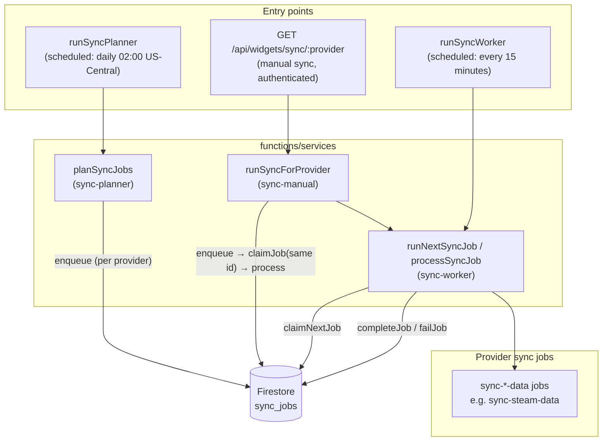
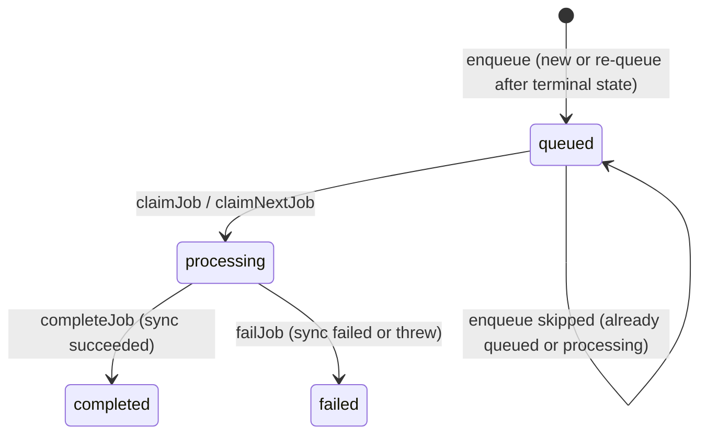

# Sync job queue

## Overview

Widget data syncs run through a **Firestore-backed job queue** so work is durable, observable, and decoupled from *who* requested it (scheduled jobs vs. manual HTTP). The queue is defined by the `SyncJobQueue` port (`functions/ports/sync-job-queue.js`); production uses `FirestoreSyncJobQueue` (`functions/adapters/sync/firestore-sync-job-queue.js`), which stores one document per logical job in the `sync_jobs` collection.

## Architecture

The diagram below matches how the pieces fit together in this repo: planners and the manual API **enqueue** work; the worker **claims** a job and runs the provider-specific sync, then **completes** or **fails** the job in Firestore.

### Scheduled vs manual paths

| Path | What runs | Queue usage |
|------|-----------|-------------|
| **Planner** (`functions/index.ts` → `runSyncPlanner`) | `planSyncJobs` | Enqueues one job per entry in `syncableWidgetIds` for the default widget user (`functions/services/sync-planner.js`). |
| **Worker** (`runSyncWorker`) | `runNextSyncJob` | Picks **one** queued job via `claimNextJob()`, runs it, then updates status. |
| **Manual HTTP** | `runSyncForProvider` | Enqueues (or skips if already queued/processing), then **claims that job id immediately** and runs `processSyncJob` inline so the response can include before/after queue state (`functions/services/sync-manual.js`). |

Planner and worker schedules are registered in `functions/index.ts` (worker uses `every 15 minutes`; planner uses the platform default, currently **daily at 02:00** in `us-central1`, see `functions/runtime/firebase-functions-runtime.ts`).

## Job identity and document shape

- **Stable job id**: `sync-{userId}-{provider}` (see `toSyncJobId` in `firestore-sync-job-queue.ts`).
- **Firestore**: collection `sync_jobs`, document id = job id.
- **Descriptor** (`QueuedSyncJobDescriptor`): `mode: 'sync'`, `provider` (a `SyncProviderId`), `userId`.
- **Statuses** (`QueuedSyncJobStatus`): `queued` → `processing` → `completed` or `failed`.

Supported sync providers are `syncableWidgetIds` in `functions/types/widget-content.js` (currently includes discogs, goodreads, instagram, spotify, steam, flickr). The manual route rejects unknown providers with `400`.

## State transitions

Enqueue and claim paths use **Firestore transactions** so two writers cannot leave the document in an inconsistent state (for example, double-claiming the same `queued` job).

- **Enqueue**: If the existing document is already `queued` or `processing`, enqueue returns `{ status: 'skipped', jobId }` and does not overwrite active work.
- **Claim**: Only a document in `queued` moves to `processing`; `runCount` increments; `lastStartedAt` / `updatedAt` are set.
- **Complete / fail**: Merges terminal fields, summary, optional error message, and timestamps.

## Worker execution

`processSyncJob` (`functions/services/sync-worker.js`) dispatches on `job.provider` to the corresponding `sync-*-data` job module, writes widget data through `DocumentStore`, then calls `completeJob` or `failJob` with a `SyncJobSummary` (`durationMs`, `result`, optional `metrics`).

## Operational notes

- **`claimNextJob`** queries `status == 'queued'` with `limit(1)` and **no `orderBy`**, so which queued job runs first is not guaranteed to be FIFO unless you add an ordering field and index later.
- **Manual sync** still goes through the same queue document so status and history stay consistent with scheduled runs.
- **Testing**: `FirestoreSyncJobQueue` is covered in `functions/adapters/sync/firestore-sync-job-queue.test.ts`; manual and worker flows have service-level tests under `functions/services/`.

## Related files

| Area | Location |
|------|----------|
| Queue port | `functions/ports/sync-job-queue.ts` |
| Types | `functions/types/sync-pipeline.ts` |
| Firestore adapter | `functions/adapters/sync/firestore-sync-job-queue.ts` |
| Planner / manual / worker | `functions/services/sync-planner.ts`, `sync-manual.ts`, `sync-worker.ts` |
| HTTP route | `functions/app/create-express-app.ts` (`/api/widgets/sync/:provider`) |
| Firebase exports | `functions/index.ts` (`runSyncPlanner`, `runSyncWorker`) |
| Bootstrap wiring | `functions/bootstrap/create-backend-bootstrap.ts` |
